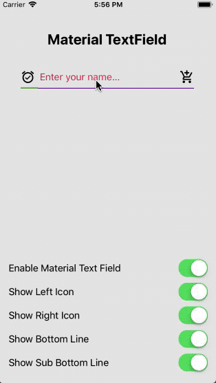

<h1>Introduction</h1>
INTUZ is presenting a custom material text field in iOS, just go through this tutorial and you will be able to integrate custom material text field in your application.

Please follow the below steps to integrate this control in your next project.

<br/><br/>
<h1>Features</h1>

- Enable/Disable Material Textfield
- Set Placeholder Color
- Show Bottom Line
- Set Bottom Line Color
- Show Bottom Sub Line
- Set Bottom Sub Line Color
- Set Bottom Sub Line Width
- Set Left Icon
- Set Right Icon
- Set Icon Margin

<br/><br/>



<br/><br/>
<h1>Getting Started</h1>

To use this component in your project you need to perform below steps:

1) Copy ‘CustomTextField.swift’ file and add it to your project and make sure you have checked “Copy if needed” option.

2) Set custom text field class in storyboard as show in below image.
<br/>


3) You can configure custom text field as per your requirement from storyboard as shown in below image.
<br/>


4) You can also update text field property from code

```
txtField.enableMaterialPlaceHolder = sender.isOn
txtField.placeholder = "Enter your name..."

txtField.leftIcon = showLeftIcon.isOn ? #imageLiteral(resourceName: "<your-image-name>") : nil

txtField.rightIcon = showRightIcon.isOn ? #imageLiteral(resourceName: "your-image-name") : nil

txtField.lineColor = UIColor.red
txtField.showBottomLine = showBottomLine.isOn

txtField.subLineColor = UIColor.green
txtField.subLineWidth = 30
txtField.showBottomSubLine = showSubBottomLine.isOn
```

<br/><br/>
<h1>Bugs and Feedback</h1>
For bugs, questions and discussions please use the Github Issues.

<br/><br/>
<h1>License</h1>
The MIT License (MIT)
<br/><br/>
Copyright (c) 2018 INTUZ
<br/><br/>
Permission is hereby granted, free of charge, to any person obtaining a copy of this software and associated documentation files (the "Software"), to deal in the Software without restriction, including without limitation the rights to use, copy, modify, merge, publish, distribute, sublicense, and/or sell copies of the Software, and to permit persons to whom the Software is furnished to do so, subject to the following conditions:
<br/><br/>
THE SOFTWARE IS PROVIDED "AS IS", WITHOUT WARRANTY OF ANY KIND, EXPRESS OR IMPLIED, INCLUDING BUT NOT LIMITED TO THE WARRANTIES OF MERCHANTABILITY, FITNESS FOR A PARTICULAR PURPOSE AND NONINFRINGEMENT. IN NO EVENT SHALL THE AUTHORS OR COPYRIGHT HOLDERS BE LIABLE FOR ANY CLAIM, DAMAGES OR OTHER LIABILITY, WHETHER IN AN ACTION OF CONTRACT, TORT OR OTHERWISE, ARISING FROM, OUT OF OR IN CONNECTION WITH THE SOFTWARE OR THE USE OR OTHER DEALINGS IN THE SOFTWARE.

<br/>
<br/>
<h1></h1>
<a href="https://www.intuz.com/" target="_blank"></a>


